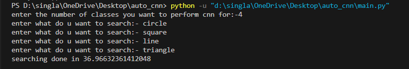
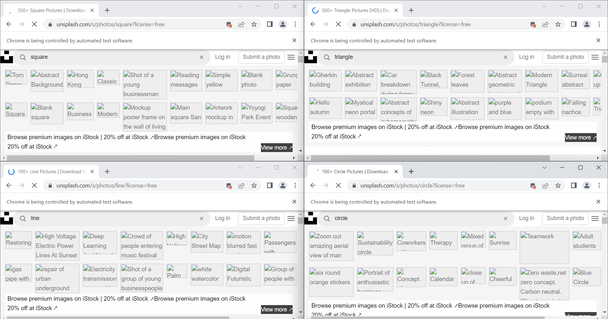
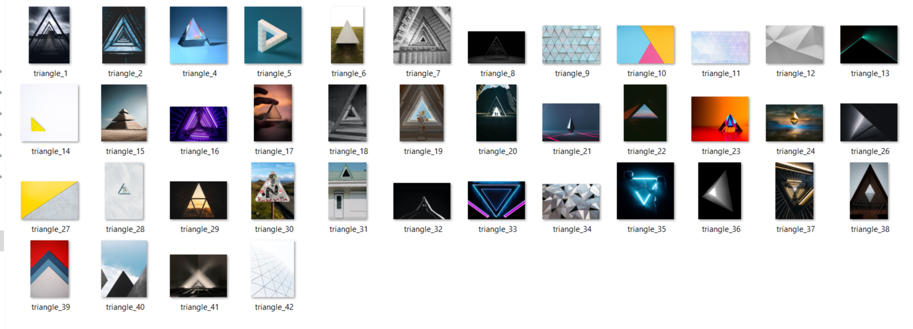
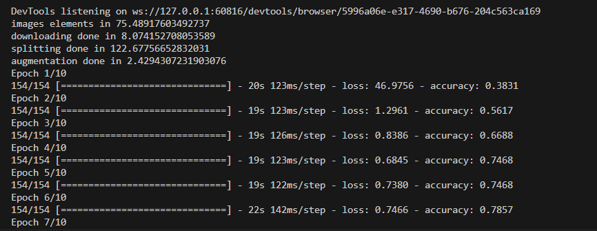
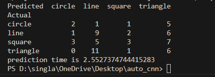

# AutoScrapeClassification: Multithreading and Augmentation

## Overview
This project performs web scraping, multithreading, and augmentation for image classification. It follows the following steps:

1. **Number of Classes**: Asks for the number of classes (2, 3, or 4).
2. **Queries**: Asks for the same number of queries or classes.
3. **Web Scraping**: Utilizes multithreading and Selenium driver to scrape web pages for all queries. It uses [Unsplash](https://unsplash.com/) for image scraping. The number of images can be increased by modifying the scroll iterations in `image_element.py`. The process handles page loading, scrolling, and closing automatically.
4. **Image Sources**: Extracts image sources from the loaded pages. It creates folders with the names of the inserted search queries. If you rerun the code, it will automatically clear the folder for the same query.
5. **Data Splitting**: Splits the data into training and testing sets. The train-test ratio can be changed in the functions of `split_data.py`.
6. **Data Augmentation**: Performs augmentation to increase the dataset size. The number of augmented images can be changed in `augmentation_training.py`. Multithreading is used with a locking mechanism during the write operation.
7. **Model Training**: Trains the model. You can also use your own model for accuracy checking.
8. **Predictions and Confusion Matrix**: Makes predictions and presents the results in the form of a confusion matrix.

## Screenshots

# AutoScrapeClassification-with-multithreading-and-augmentation
